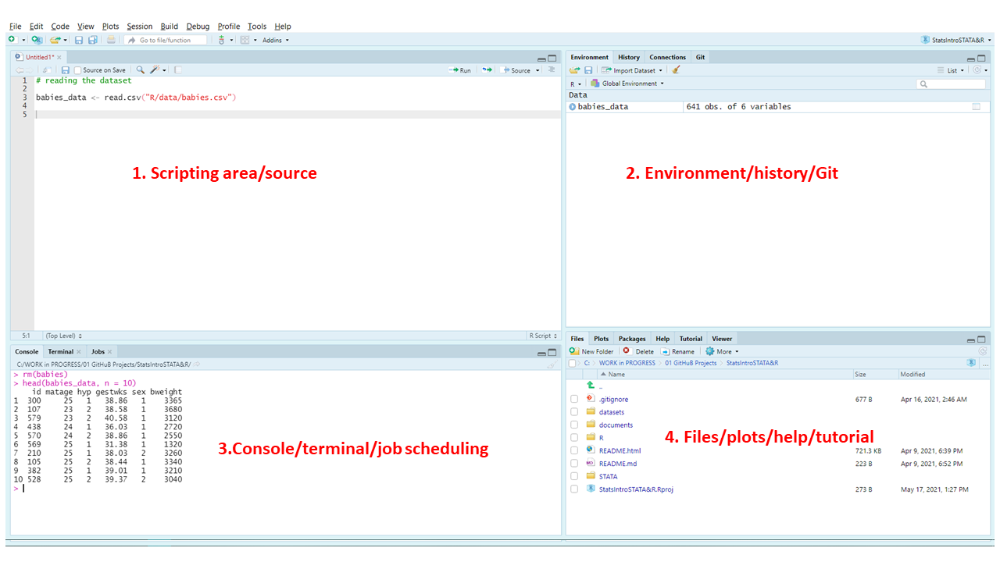

```{r setup, include=FALSE}
knitr::opts_chunk$set(echo = T,
                      message = F,
                      warning = F,
                      comment = "")
```


# What is R

- R is both a scripted programming language and software environment for statistical computing.\vspace{5mm}

- R is widely used for statistical analysis and creation of high-quality publishable graphics.\vspace{5mm}

- It's open source, free to use and supported by a large community of users and developers. \vspace{5mm}

- Flexible and highly scalable via user defined packages and functions.


# Why R

- \textcolor{blue}{Reproducibility} - one code; multiple users and projects .\vspace{5mm}

- \textcolor{blue}{Flexible} and easy to learn.\vspace{5mm}

- \textcolor{blue}{Scalability} - You can define/customize your own functions and/or packages. \vspace{5mm}

- \textcolor{blue}{Interoperability} - same code across platforms (mac, windows, linux etc).


# Getting started - Installing R and Rstudio

- You can install the latest version of R from the  [\textcolor{blue}{CRAN repository}](https://cran.r-project.org/). CRAN stands for **C**omprehensive **R** **A**rchive **N**etwork\newline

- The latest version or R is 4.0.5 as of time of the slide creation. This might change with time\newline

- Rstudio is an IDE (Intergrated Development Environment for R). You can install the latest version of Rstudio [\textcolor{blue}{here}](https://www.rstudio.com/products/rstudio/download/#download)

     - **NOTE:** You do not need Rstudio to use R, BUT it makes things easier. So I will highly recommend you to install Rstudio for easy and efficient coding in R.


# Introduction to R and Rstudio

```{r, out.width="100%",fig.align='left',out.height="80%", echo=F}
knitr::include_graphics("R_simple.PNG")
```


# Components of Rstudio
```{r, out.width="100%",fig.align='left',out.height="90%", echo=F}

```


# How R works (expression vs assignment)
- R syntax is easy to use. Type commands after the prompt `>` and hit enter to execute in console.\vspace{2mm}
- Simple illustration, using R as an overgrown calculator to evaluate mathematical computation.\vspace{2mm}
- Broad classification of R syntax:-\vspace{2mm}
    - **Expression** - Commands are evaluated, printed on console and the value is lost (requires re-typing).
    - **Assignments** - Storing intermediate results of an expression to an object which can be re-used.
- Objects are created in memory and saved into a file called `.RData`.\vspace{2mm}
- R commands are stored in a file names `.Rhistory`. \vspace{2mm}
- R is sensitive `name` and `Name` refer to different variables


# Interactive R session: 01 - How R works

## We switch to R and write code to demonstrate the ideas.


# R data structures(1/4) - Introduction

- We assign results of expressions into objects with unique names in R.\vspace{2mm}

- Objects can be of different forms. Most common types include:-
   - Vectors (building block of R language)
       - Atomic vectors - Homogeneous, contains items of ONLY one data type
       - Lists - Heterogeneous, contains objects of any type
   - Matrices\vspace{1mm}
   - Data frames \vspace{1mm}
   - Arrays \vspace{1mm}
   - Complex numbers* \vspace{1mm}
   - Raw*. \vspace{2mm}

- These ecosystem of different forms of objects is referred to as data structures.\vspace{2mm}

# R data structures(2/4) - vectors

- Vectors are the building blocks in R.\vspace{5mm}

- Atomic vectors are the simplest type of objects and are classified into:-
    - Logical \vspace{2mm}
    - Integer \vspace{2mm}
    - Double \vspace{2mm}
    - Character \vspace{5mm}
    
    
- We use the function `c()` `meaning combine items` to create vectors in R

- Generic functions `ls()` and `rm()` are used to list and remove objects in the workspace.

# Interactive R session: 02 - Creating vectors in R

## We switch to R and write code to demonstrate the ideas.


# R data structures(3/4) - Lists

A list is a generic vector containing objects/elements of different data types (heterogenous).

We  construct lists using the function `list()`. Lists are also reffered to as recursive vectors because it can contain other lists.

```{r eval=F}
my_list <- list(
  c(3,4,5,8),
  c("Mon","Tu","wed","Thur","Fri","Sat"),
  matrix(1:10, byrow = T, nrow = 5)
)

str(my_list)
```


# Interactive R session: 03 - Getting to know lists

## We switch to R and write code to demonstrate the ideas.


# R data structures(4/4) - data frames

Data frames generally refer to tabular data (rows and coloumns). A data frame is the most common way of storing data in R.

This means that a data frame has both coloumn and row names. Basically a data frame is a list of vectors of equal length

Data frames are created using the function `data.frame()` which takes named vectors as arguments.

```{r eval=F}
my_dataframe <- data.frame(
  col_1 = c("values_to_go_to_this_coloumn1"),
  col_2 = c("values_to_go_to_this_coloumn2")
  col_n = c("values_to_go_to_this_coloumnn")
)
```
Let's practice on data frames using other functions such as `head()` and `tail()` in addition to the now `str()` that you are familiar with.

# Interactive R session: 04 - Data frames

## We switch to R and write code to demonstrate the ideas.


# Exercise one


# Subsetting/Indexing elements of an object

More often you will want to extract elements or components of a vector, list, matrices and data frames.
We apply 3 types of indexing when extracting elements of an object (where index denotes the position of the element in the vector)

- Integer vector indexing (`negative` _omits_ while `positive` _retains_ )
- character vector indexing
- logical vector indexing

Note: For **Integer vector indexing**, unlike other programming languages (`python, Java and C++`) that starts indexing from **0**, indexing of objects in R starts from **1**


# Interactive R session: 05 - Subsetting objects

## We switch to R and write code to demonstrate the ideas.


# External R packages and getting help

- An R package is a collection of R functions and/or data with a well
compiled code(s) that enable R users perform even more tasks with
R(expand functionality). 

- Examples of R packages include dplyr, ggplot2 etc.
There are currently over 13,000 contributed packages in the Comprehensive
R Archive Network(known as CRAN).

**Common commands**

- install.packages(“package name”) # to install a package
- library(package name) # load an R package into the workspace for use,
also require(package name)

- To get help on a particular function, use ?function_name or help("function_name") and you will be presented with a documentation on arguments and use case of an R function.


# Interactive R session: 06 - R packages

## We switch to R and write code to demonstrate the ideas.


# The concept of working directory and file paths

1. The working directory is the **specifc folder** within your computer where your live R session is hosted/pointing to. This folders by default holds all your .RData files and .Rhistory files.

     - `getwd()` to get to know where your working directory is located, get help `?getwd`
     - `setwd()` to set a new location for your working directory, get hwlp `?setwd`
     
2. The **file path** is the specific folder address that contains your files of interest. A file path can be a folder within the working directory or outside the working directory

**NOTE:** The above concepts are very key when reading data into R, therefore a clear understanding of how they work will come in handy in importing data into R suing any method defined.


# Interactive R session: 07 - Working directories

## We switch to R and write code to demonstrate the ideas.


# Reading data into R

- Data can be read into R from various sources.

- **General way** using the command **`read.table()`**.

You can read a variety of file extensions into R using the function `read.table()`.
Some examples of applicable files to read include csv, tab delimited(.txt), space demilited and any flat file so long as it's defined interms of what character separates its coloumns.

**NOTE:** Knowing the extension of the file you are reading and how its coloumns are separated is essential in using `read.table()` command.

- **More specif way** using the command **`read.csv()`**.

-used to read *comma separated files ONLY* otherwise reffered to as `.csv`. More convinient for csv files in that it pre-populates arguments for you which you would  have specified  in `read.table()` such as `header=T` or even `sep=","`.

get help by `?read.table` or `read.csv`

# Interactive R session: 08 - Getting data into R

## We switch to R and write code to demonstrate the ideas.


# Exercise Two


# Introduction to `dplyr` for data management in R

- We are going to focus on the **dplyr** package which is a core member of the group of packages called `tidyverse`.
- `dplyr` package makes data transformation and manipulation easy by providing simple verbs that correspond to common data manipulation tasks which helps  you translate your **thoughts** into code.


The main verbs for data manipulation provided by `dplyr` include:-

- `select()` and `rename()` to select variables based on their names/rename variables.
- `mutate()` and `transmute()` to add/create new variables.
- `filter()` to select cases/rows based on their values.
- `arrange()` to reorder the cases/rows.
- `summarise()` to condense multiple values to a single value. Can be used together with `group_by()`
- `sample_n()` and `sample_frac()` to take random samples.

# Interactive R session: 09 - Data management basics

## We switch to R and write code to demonstrate the ideas.

# Reference material

- [\textcolor{blue}{An introduction to R hand-out}](https://cran.r-project.org/doc/manuals/r-release/R-intro.pdf)\vspace{2mm}

- [\textcolor{blue}{R for beginners}](https://cran.r-project.org/doc/contrib/Paradis-rdebuts_en.pdf)\vspace{2mm}

- The book [\textcolor{blue}{R for Data Science}](https://r4ds.had.co.nz/)\vspace{2mm}

- Introduction to R slides by [\textcolor{blue}{Dr. Norma Coffey}](https://www.scribd.com/document/284508628/R-Slides)\vspace{2mm}

- The book [\textcolor{blue}{R in Action}](http://www.cs.uni.edu/~jacobson/4772/week11/R_in_Action.pdf) for data analysis and graphics\vspace{2mm}

- [\textcolor{blue}{Quick R}](https://www.statmethods.net/) help.

- Extensive online help twitter, Github, StackOverflow


